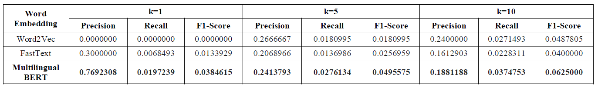

<p align="center">
  <h2 align="center">Pseudo-bilingual Corpora</h2>
  <h3 align="center">Javanese and Sundanese Dictionary</h3>
</p>

## Model Description
<p>This approach merge two corpus from different languages into a pseudo-bilingual corpus. We used length-ratio shuffle to merge the corpus. The method generates a new pseudo-bilingual corpus separated from the input corpus. Each sentence in monolingual corpus is added to the pseudo-bilingual corpus based on the ratio of the length of two monolingual corpus.</p>

## Architecture Design
<p align="center">
    
</p>

1. The Javanese and Sundanese corpus preprocessed. The preprocessing process consist of deleting English words and sentence windowing. 
2. Then, both corpora merged into a pseudo-bilingual corpus using length-ratio shuffle. 
3. After that, word vector representation generated from the pseudo-bilingual corpus using FastText, Word2Vec, and feature extraction pre-trained multilingual BERT model. 
4. Last, from the cross-lingual representation, pair translation retrieved using nearest-neighbor method.
## Experiment Result

<p align="center">
    
</p>

- The Word2Vec – Length Ratio Shuffle model enabled to produce translation pairs at k = 1. While the two others model are able to produce translation pairs at k =1 although with very low f1-score value.
- In this approach, model with highest performance is Multilingual BERT – Length Ratio Shuffle. The model achieved f1-score value 0.03845 for k = 1.
- Most of the translation pair result (> 73%) is pairs of Javanese words.
- The model cannot produce correct pair translation with same spelling words.

## How to use?
### 1. Data Preparation
You can collect [Javanese](https://dumps.wikimedia.org/suwiki/latest/suwiki-latest-pages-articles.xml.bz2) and [Sundanese](https://dumps.wikimedia.org/jvwiki/latest/jvwiki-latest-pages-articles.xml.bz2) corpus from Wikipedia dumps articles file. Then, preprocess the data using following command.
- Sentence Windowing
```
python3 corpus_windowing.py <corpus_file> <output_file>
```
- Remove English Words
```
python3 data_cleaning.py <embedding_file> <english_words_file> <output_file>
``` 
### 2. Merge: Length-ratio Shuffle
Create a pseudo-bilingual corpus using length-ratio shuffle method.
```
python3 merge.py <input_file1> <input_file2> <output_file>
```
### 3. Word Embedding
Create word representasion from a pseudo-bilingual corpus. We use Word2Vec, FastText, and feature extraction on pre-trained Multilingual BERT model.
- Word2Vec
```
python3 word2vec.py <corpus> <output_vector_file>
```
- FastText
```
python3 fasttext.py <corpus> <output_vector_file>
```
- Multilingual BERT
```
python3 mBERT.py <corpus> <output_vector_file>
```
### 4. Translation Retrieval and Evaluation
Generate pair translation and evaluate the translation result.
```
python3 eval_pseudo_bilingual.py <emb_file> <dict_file> <file_wrong> <file_corect>
```
